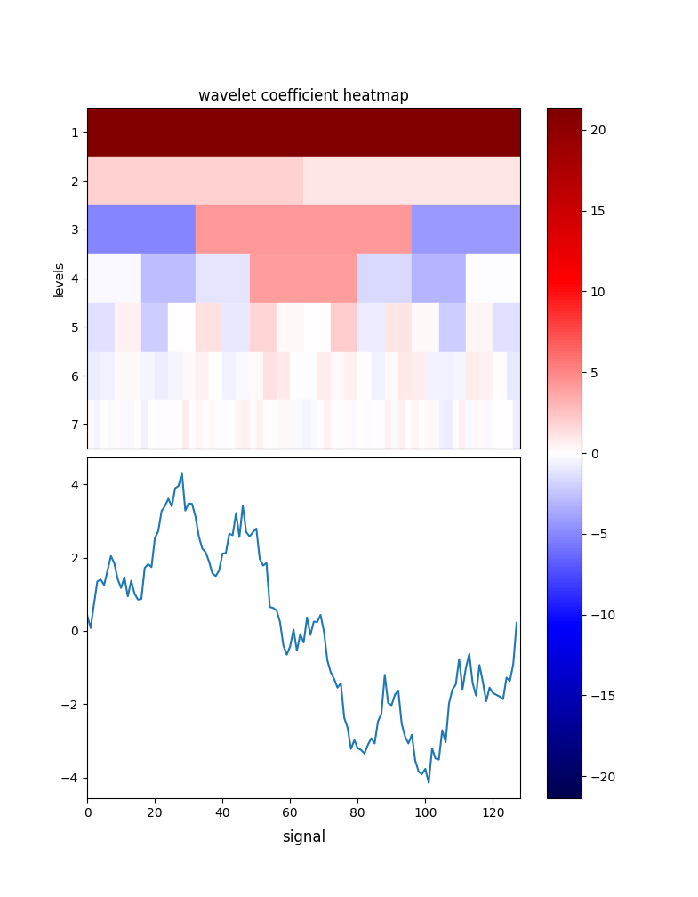

## DWTVIZ

This library creates a visualization of a discrete wavelet transform of a signal.

#### Simple Useage

```.py
import numpy as np

x = np.linspace(0, np.pi * 2, 128)
signal = np.sin(6 * x) + 3 * np.sin(x) + np.random.normal(0, .3, 128)

from dwtviz import dwtviz
dwtviz(signal)

fig = dwtviz(signal)
fig.show()
```



#### Options

dwtviz is built on [pywt](https://github.com/PyWavelets/pywt) and 
[matplotlib](https://github.com/matplotlib/matplotlib). It can be used with any
pywt.Wavelet object or any string representing a wavelet built into pywt, as
defined
[here](http://pywavelets.readthedocs.io/en/latest/ref/wavelets.html#wavelet-object).

It can also be used with any
matplotlib [color map](http://matplotlib.org/users/colormaps.html),
though I recommend using a divergent color scheme.

Finally, you can specify the level to which to run the decomposition, and
whether or not to include the approximation coefficients in the heatmap.

#### Docstring
```.py
"""
params:
-----
signal:
    The signal to be decomposed.

wavelet:
    The wavelet to use. This can be either a string or a pywt.Wavelet object.

levels:
    The number of levels to which the signal will be decomposed. Defaults to
    the maximum decomposition depth.

approx:
    Boolean indicating whether the approximation coefficients will show up
    on the heatmap. Defaults to false if level is None, true otherwise.

cmap_name:
    The name of the matplotlib colormap to use. Defaults to seismic. I
    recommend using a divergent colormap so that negative numbers are
    evident.

returns:
-----
f:
    A matplotlib figure containing a heatmap of the wavelet coefficients and
    a plot of the signal.
"""
```
